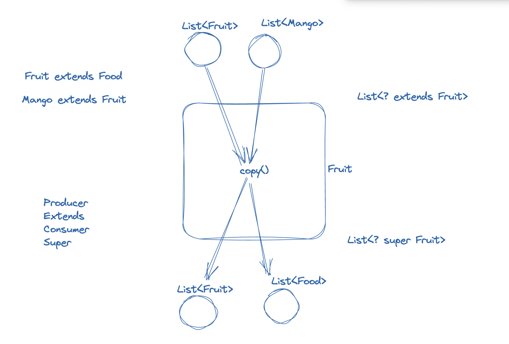

## Variance 

### Basic Definition 

```text
f(x) = 10x 


x1 > x2   =>  f(x1) > f(x2)	
x1 < x2   =>  f(x1) < f(x2)	


g(x) = 1/x 

x1 > x2 =>   g(x2) > g(x1)

k(x) = 1 - x

x1 > x2 =>   k(x1) ?? k(x2)			invariance


for f(x) ">" and "<" are covariant 

for g(x) "<" and ">" are contravariant 


```


### Example with Classes 
```text 

B extends A 

List<B> ?? List<A> 			invariant 

"generic covaraint wildcarded type" -> "? extends E"


B extends A 

List<B> extend List<? extends A>
i.e. 

List<B> can be passed where List<? extends A> is needed
List<B> can NOT be passed where List<A> is needed


B extends A
C extends B

We can pass B where A is needed
We can pass C where B is needed


List<B>, List<A>, List<C> -> these are all unrelated, (invariance)

List<B> can be used where List<? extends A> is written; (covariance)
				

List<A> can be used where List<? super B> is written;  (contravariance)


```

